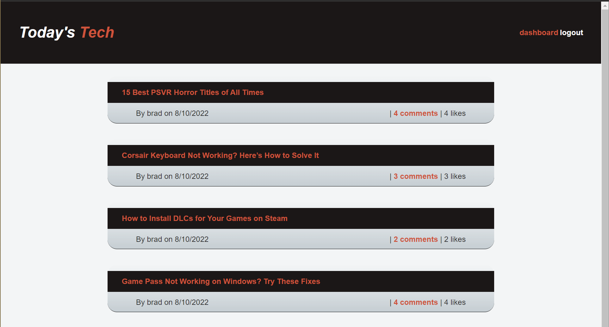
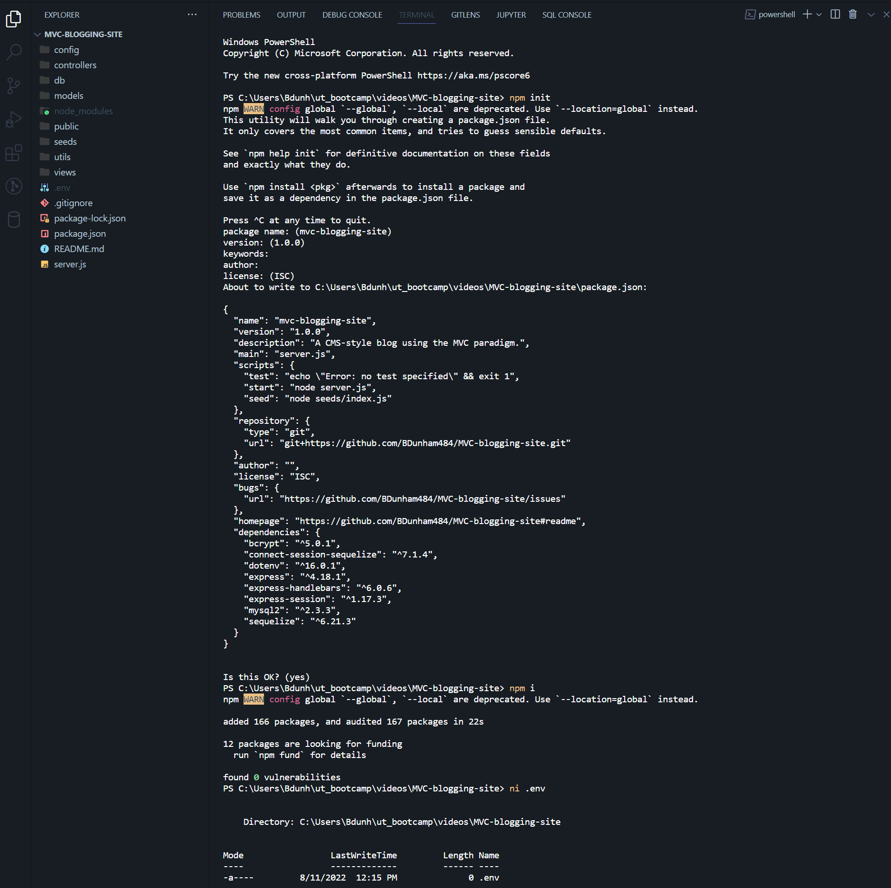

# MVC-blogging-site  

## Description: 

* A CMS style tech blog applying the MVC paradigm

* <a href='https://powerful-journey-30948.herokuapp.com/'>https://powerful-journey-30948.herokuapp.com/</a>

## Table of Contents

- [Installation](#installation)
- [Usage](#usage)
- [License](#license)
- [Code Contributors](#code-contributors)
- [Contributing](#contributing)
- [Test](#test)
- [Questions](#questions)

## Installation

* Run `npm init -y` from command line
* run `npm i` to install dependencies
* Create a .env file in the root folder
* In the .env file
*  enter your MySQL login credentials in the following format:
* `DB_NAME='kenny_bloggins_db'`
* `DB_USER='<username>'`
* `DB_PW='<password>'`
* App can be seeded by running `npm run seed`

Back to [top of page](# )

## Usage

* Run `npm start` from command line and enter `http://localhost:3001' in browser's address bar

Back to [top of page](# )

## License

* This application is covered under the <a href='https://opensource.org/licenses/MIT'>MIT License</a>.

Back to [top of page](# )

## Code Contributors

#### Made with ❤️ by:

* Brad Dunham

Back to [top of page](# )

## Contributing

Feel free to submit an issue!

Back to [top of page](# )

## Test

* nah

Back to [top of page](# )

## Questions?

* If you have any questions you can find me here: <https://www.github.com/BDunham484>
* You can also reach me here: bdunham484@gmail.com

Back to [top of page](# )

    